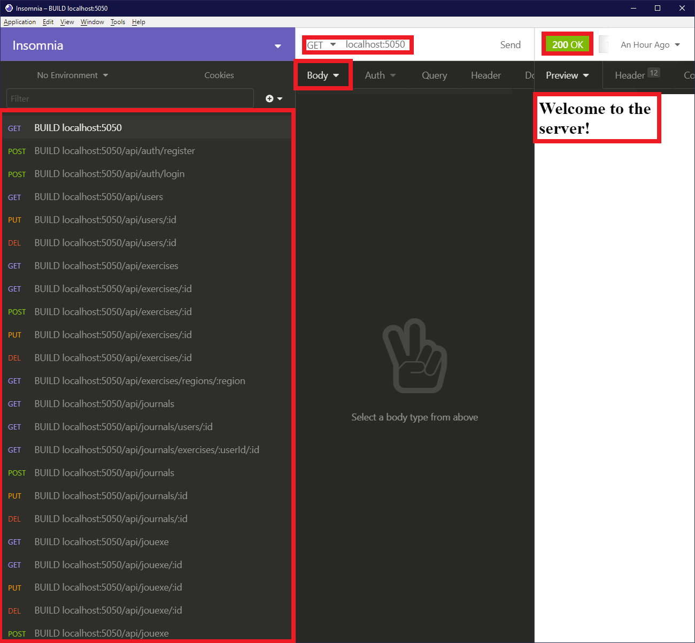
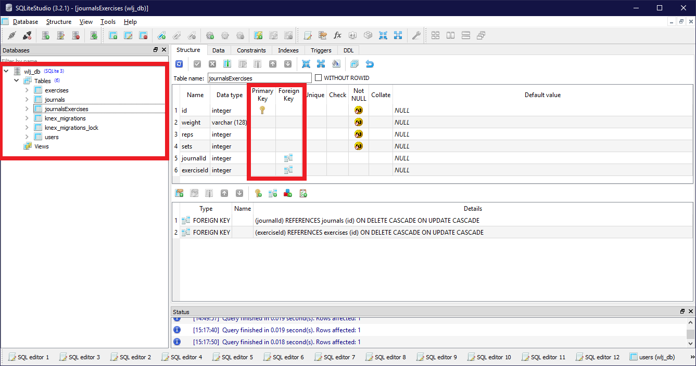

# weight-lifting-journal-3-backend
Backend for weight-lifting-journal-3

# Initializing the Project
## Requirements: Insomnia

1) Install Insomnia.
2) Create a "New Request".
3) Select a "GET" request for now.
4) Use `localhost:5050` for the address.
5) OR if you are using Heroku, use this link for the address instead - "https://weight-lifting-journal-3.herokuapp.com/".
6) Send the request.
7) You should get the message "Welcome to the server!".

# Users
## Register and Login

JSON requirements for users:
```
{
"firstName": "First Name",
"lastName": "Last Name",
"email": "Email",
"password": "Password"
}
```

1) At the end of `localhost:5050` (or the Heroku link "https://weight-lifting-journal-3.herokuapp.com/") in your address, put `api/auth` to use authorizationfor these routes. In example `localhost:5050/api/auth`.
For all of the following instructions you may replace `localhost:5050` with the Herokuu link if you want to use the hosted server.

## To Register

2) Select "POST" as the request.
3) The address should be `localhost:5050/api/auth/register`. This is your registration endpoint.
4) Under "Body" choose the "JSON" format in which you will register with. The JSON format should look similar to the following -
```
{
"firstName": "Your First Name Here",
"lastName": "Your Last Name Here",
"email": "Your Email Here",
"password": "Your Password Here"
}
```
5) Send that "POST" request and you will get back JSON information with an `id` included. You are now added as a user to the database.

## To Login

7) Right click that registration request and duplicate it. In the address bar of the duplicated request, remove `register` and replace it with `login`. In example - `localhost:5050/api/auth/login`. Keep the JSON data as it is.
8) Send this "POST" request. You will be logged in and a message will be returned - "Welcome "firstName lastName"!" and a "token".
9) Inside the quotes for the "token" value is your authorization, copy that entire string.
10) Click on the headers tab, and add a new header. The header must be called
`Authorization`. And the value must be your `Token` string.

## To View Existing Users

1) Duplicate this last request, which will in turn duplicate the `Authorization` header with the `Token` string that you added previously. If there is no token, the server will respond with an error. Tokens last 24 hours after a login.
2) Change the address to `localhost:5050/api/users` to recieve back ALL users, or `localhost:5050/api/users/:id` (Where `:id` is the id of the user) to get back a specific user with that Id.
3) Change the request back to a "GET" and send the request to recieve the JSON information back. 

## Updating the User

1) Using a "PUT" request to the address of `localhost:5050/api/users/:id`, you would select a user by its id, and use the following JSON information to update the existing user.
```
{
    "email": "Updated Email Here",
    "password": "Updated Password Here",
    "firstName": "Updated First Name Here",
    "lastName": "Updated Last Name Here"
}
```
2) Your updates will be shown in the return preview window in Insomnia

## Deleting the User

1) Using a "DELETE" request to the address of `localhost:5050/api/users/:id` you would select a user by its id, and send the "DELETE" request. 
2) That user is should now be deleted from the database.

# Exercises

1) Send a "GET" request to `localhost:5050/api/exercises` to access all of the exercises in the database. You may also speicify an `Id` at the end to get a specific exercise back. You can also use a specified Id to make a "DELETE" request to that exercise.

2) To update or add a new exercise you will need to use "POST" or "PUT" as before but with the following JSON data -
```
{
    "name": "Exercise Name"
    "region": "Muscle Group Being Used"
}
```

## Get Exercises by Body Region

1) Send a "GET" request to the endpoint `localhost:5050/api/exercises/regions/:region` where region is the muscle group you want to search for. In Example- `chest`, `shoulders`, `legs` etc. Using lowercase for these fields will keep everything working properly.

# Journals 

1) Send a "GET" request to `localhost:5050/api/journals` to recieve all existing journals.

2) To update or add a new journal use this JSON information with a "POST" or "PUT".

```
{
    "userId": (here you put an integer that matches the Id of a user)
    "name": "Name of the Journal Here"
    "date": "Date Here"
}
```

## Get All Journals From a Specific User

1) Send a "GET" request to `localhost:5050/api/journals` to see all journals from all users.
2) OR send a "GET" to `localhost:5050/api/journals/users/:id` to specify the Id of the user for which you'd like to see journals from.

## Get All Exercises From a Journal For a Specific User

1) Send a "GET" to `localhost:5050/api/journals/exercises/:userId/:id` where `:userId` is the integer for the user's Id that you want a Journal from, and `:id` is the integer for the Id of the Journal you want to access the Exercises from.
2) Journals on creation are empty untill exercises are added (How to do that is below)


# Journals and Exercises

1) Send a "GET" to `localhost:5050/api/jouexe` to see all exercises within any journal.
2) OR send a "GET" to `localhost:5050/api/jouexe/:id` where `:id` is the specific Id for a journal exercise.

3) To update or add a new Journal Exercise, use the same endpoint `localhost:5050/api/jouexe/:id` with a "PUT" or "POST" including the following information.

```
{
    "weight": (integer or string for description),
    "reps": (integer for reps),
    "sets": (integer for sets),
    "journalId": (integer of the journal id that we want to add this exercise to),
    "exerciseId": (integer of the exercise id that we want to add to the journal)
}
```
4) You must use a journalId and an exerciseId in order for the database to know how data works together.

# All Endpoints in Insomnia



# Database Setup for Journal / Exercises



